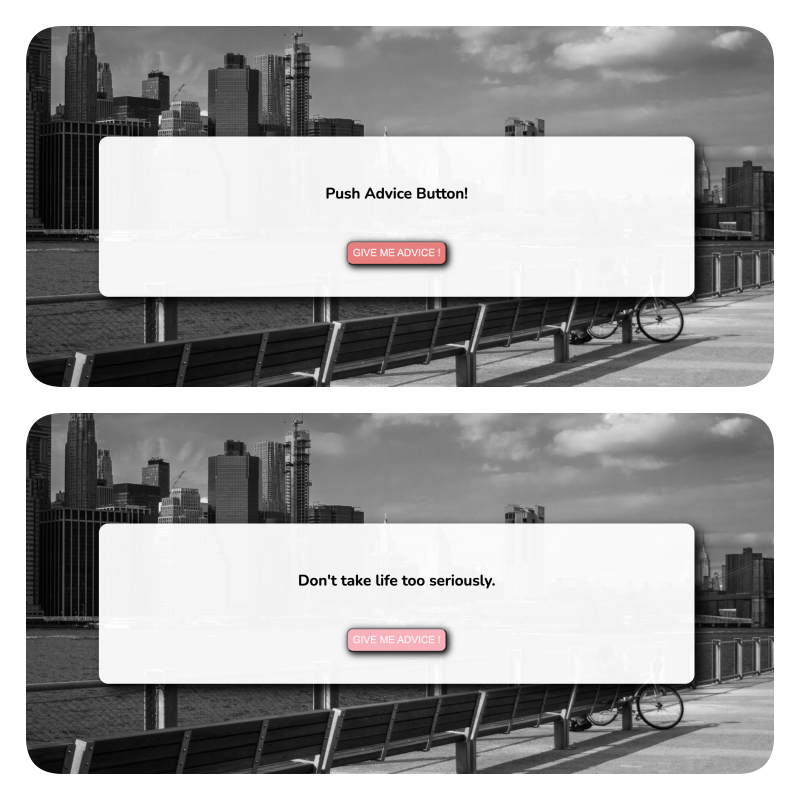

# JavaScript Random Advice

> 바닐라 자바스크립트를 사용한 Random Advice App

## Overview

- 사용된 언어 및 프레임 워크: HTML, CSS, JavaScript

## Feature

<p align="center">

 

</p>

- 자바스크립트의 `fetchAPI`를 이용해서 비동기로 서버의 API를 불러와 버튼을 누르면 새로고침 없이 무작위로 조언을 보여주는 기능 구현

## Installation

1. 저장소 클론

```sh
$ git clone https://github.com/hyunwoome/js-random-advice.git
```

2. vscode의 [liveserver](https://marketplace.visualstudio.com/items?itemName=ritwickdey.LiveServer) 익스텐션으로 개발용 서버 실행

## Impression

간단한 기능이지만 `fetchAPI`를 사용하면서 `promise`의 사용법을 익힐 수 있었다.

## License

© 2021 Hyunwoo Lim

This repository is licensed under the MIT license. See `LICENSE` for details
